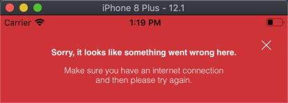

# react-native-message-bar


 
[](https://npmjs.org/package/react-native-message-bar "View this project on npm")

A message bar notification component displayed at the top of the screen for React Native (Android and iOS) projects.

- Originally created by [KBLNY](https://github.com/KBLNY/) 
- Forked from [Talor Anderson](https://github.com/talor-a/)




## Content
- [Features](#features)
- [Installation](#installation)
- [Basic Usage](#basic-usage)
- [Hide the Message Bar Alert](#hide-the-message-bar-alert)
- [Customize Alert Type](#customize-alert-type)
- [Customize Alert Content](#customize-alert-content)
- [Customize View Layout](#customize-view-layout)
- [Customize Position and Animation, Twitter Style!](#customize-position-and-animation-twitter-style)
- [Properties](#properties)
- [Contributing](#contributing)
- [TODOS](#todos)
- [Apps using this library](#apps-using-this-library)
- [License](#license)


## Features
- Android and iOS capable
- Animated alert with Title & Message
- Top or Bottom display
- 4 Slides Animation Types (Alert is shown from top, from bottom, from left or from right)
- Auto-hide after x seconds (customizable and/or can be disabled)
- Auto-hide current alert to display a newer one, if context requires to do so
- Close icon
- 2 pre-configured styles, ability to make more
- Customizable texts, styles, durations, positions and animation
- Callbacks on alert show, hide and close icon tap
- Orientation supported
- Children component support Show/Hide alert


## Installation
Install package from GitHub.

```shell
npm install --save valtech-nyc/react-native-message-bar
```

## Basic Usage
1. Import the `react-native-message-bar` package

    ```javascript
    import { MessageBar, MessageBarManager, alertTypes } from 'react-native-message-bar';
    ```

1. Create a `ref` for your MessageBar

    ```javascript
    // Within your constructor
    this.messageBarRef = React.createRef();
    ```

1. Add the `MessageBarAlert` to your render function

    **Note**: Add it at the very end of your render function, the alert will then be displayed over any component of the view
    ```javascript
    // Within your render function; include the MessageBar once
    // within your top View element; make sure you add the MessageBar
    // at the very bottom of your master component so it will be displayed
    // over all other components
    <MessageBar
        ref={this.messageBarRef}
    />
    ```

1. Register and Release your Message Bar as the current main alert

    ```javascript
    componentDidMount() {
        // Register the alert located on this master page;
        // this MessageBar will be accessible from the main component
        // and its child components; the MessageBar is declared only once
        MessageBarManager.registerMessageBar(this.messageBarRef.current);
    }
    
    componentWillUnmount() {
        // Remove the alert located on this master page from the manager
        MessageBarManager.unregisterMessageBar();
    }
    ```

1. Display the Message Bar Alert on demand

    ```javascript
    // Call this method after registering your MessageBar as the current alert
    // By calling this method the registered alert will be displayed
    // This is useful to show the alert from your current page or a child component
    MessageBarManager.showAlert({
        title: 'Your alert title goes here',
        message: 'Your alert message goes here',
        alertType: alertTypes.warning,
        // See Properties section for full customization
        // or check `index.ios.js` or `index.android.js` for a complete example
        // (though to be honest, those examples may not be working...)
    });
    ```

Please note, if you do not provide a `alertType`, the `warning` one will be chosen for you.

The normal `duration` of the notification is 3 seconds (3000 ms), you can override it.
After this time, the notification will hide.

## Hide the Message Bar Alert

```javascript
// You can force the current alert to be hidden through the Manager
MessageBarManager.hideAlert();
```

## Customize Alert Type
The Message Bar Alert comes with 2 pre-configured styles.
These alert styles define the background color of the alert and the text color.
The 2 pre-configured alert styles are:
- `warning`
- `error`

```javascript
MessageBarManager.showAlert({
    /* ... */
    
    alertType: alertTypes.warning,
    
    /* ... */
});
```

## Customize Alert Content
You can customize the style of the title & message.

```javascript
MessageBarManager.showAlert({
    /* ... */
    
    title: 'John Doe', // Title of the alert
    message: 'Hello, any suggestions?', // Message of the alert
    
    /* Number of Lines for Title and Message */
    titleNumberOfLines: 1,
    messageNumberOfLines: 0, // Unlimited number of lines
    
    /* Style for the text elements */
    titleStyle: {{
    color: 'white',
        fontSize: 18,
        fontWeight: 'bold',
    }},
    messageStyle: {{
        color: 'white',
        fontSize: 16,
    }},
    
    /* ... */
});
```


## Customize Message Bar Alert Layout
You can customize the padding, margin, and text padding of the alert.

```javascript
MessageBarManager.showAlert({
    /* ... */

    // Margin of the View, useful if you have a navigation bar
    // or if you want the alert be shown below another component
    // instead of the top of the screen
    marginTop: 0,
    marginBottom: 0,
    marginLeft: 0,
    marginRight: 0,
    
    // Padding of the view, useful if you want to apply
    // a padding at your alert content
    paddingTop: 0,
    paddingBottom: 0,
    paddingLeft: 0,
    paddingRight: 0,
    
    // Padding around the content,
    // useful if you want a tiny message bar
    textsPaddingTop: 26,
    textsPaddingBottom: 26,
    textsPaddingLeft: 38,
    textsPaddingRight: 38,
    
    /* ... */
});
```


## Customize Position and Animation, Twitter Style!
You can choose the position (`top`or `bottom`) of the alert.
You can choose the way the alert is shown (`SlideFromTop`, `SlideFromBottom`, `SlideFromLeft` or `SlideFromRight`).

```javascript
import positions from './MessageBar/positions';
import animationTransformTypes from './MessageBar/animationTransformTypes';

MessageBarManager.showAlert({
    /* ... */

    /* Position of the alert and Animation Type the alert is shown */
    position: positions.top,
    animationType: animationTransformTypes.slideFromLeft,

    /* ... */
});
```

## `showAlert` Parameters
Prop                  | Type     | Default              | Description
--------------------- | -------- | -------------------- | -----------
title                 | String   |                      | Title of the alert
message               | String   |                      | Message of the alert
alertType             | String   | `warning`            | Alert Type: you can select one of 'error' or 'warning', or add your own
duration              | Number   | `3000`               | Number of ms the alert is displayed
shouldHideAfterDelay  | Bool     | `true`               | Tell the MessageBar whether or not it should hide after a delay defined in the `duration` property. If `false`, the MessageBar remain shown
onCloseIconTapped     | Function |                      | Callback function after close icon is tapped
onShow                | Function |                      | Callback function after alert is shown
onHide                | Function |                      | Callback function after alert is hidden
durationToShow        | Number   | `650`                | Duration of the animation to completely show the alert
durationToHide        | Number   | `650`                | Duration of the animation to completely hide the alert
marginTop             | Number   | `0`                  | Top margin
marginBottom          | Number   | `0`                  | Bottom margin
marginLeft            | Number   | `0`                  | Left margin
marginRight           | Number   | `0`                  | Right margin
paddingTop            | Number   | `0`                  | Top padding
paddingBottom         | Number   | `0`                  | Bottom padding
paddingLeft           | Number   | `0`                  | Left padding
paddingRight          | Number   | `0`                  | Right padding
textsPaddingTop       | Number   | `26`                 | Top padding of texts
textsPaddingBottom    | Number   | `26`                 | Bottom padding of texts
textsPaddingLeft      | Number   | `38`                 | Left padding of texts
textsPaddingRight     | Number   | `38`                 | Right padding of texts
titleNumberOfLines    | Number   | `1`                  | Number of lines of the title. `0` means unlimited
messageNumberOfLines  | Number   | `2`                  | Number of lines of the message. `0` means unlimited
titleStyle            | Style    | `{ fontWeight: 'bold', marginBottom: 12, fontSize: 12, fontFamily: 'Helvetica-Bold', letterSpacing: -0.05, textAlign: 'center', }` | Style of the title
messageStyle          | Style    | `{ fontSize: 12, fontFamily: 'Helvetica-Light', letterSpacing: -0.05, textAlign: 'center', }` | Style of the message
position              | String   | `top`                | Define the position of the alert, can be `top` or `right`
animationType         | String   | `SlideFromTop`       | Define the way the alert is animated on the view, can be `SlideFromTop`, `SlideFromBottom`, `SlideFromLeft` or `SlideFromRight`. If no value is specified, the animation type is selected for you based on the `position`; `SlideFromTop` if `position` is equal to `top`, `SlideFromBottom` if `position` is equal to `bottom`. The alert will then be smoothly displayed
children              | Object   | `null`               | Children components to render beneath the message bar content

## Contributing
1. Fork this Repo first
2. Clone your Repo
3. Install dependencies by $ npm install
4. Checkout a feature branch
5. Feel free to add your features
6. Make sure your features are fully tested
7. Publish your local branch & open a pull request
8. Enjoy hacking <3

## TODOS
- [ ] Add Alert Queuing System
- [ ] Add Other Animations Type (Fade-in, Elastic, etc.)
- [ ] Add customizable Animation (inject your configuration)
- [ ] Anything that can help to improve :) Thanks for contributions

## Apps using this library
- Your App here...

---

## License
`React-Native-Message-Bar` is released under MIT License. See `LICENSE` for details.

>**Copyright &copy; 2016 KBLNY, 2019 Valtech.**

*Please provide attribution, it is greatly appreciated.*
